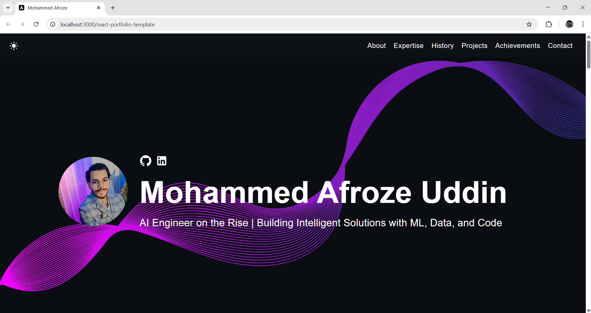

# Mphammed Afroze Uddin | AI Engineer Portfolio 🚀

      

## What is this?

This portfolio showcases my projects, experiences, achievements, and skills as I pursue a career in Artificial Intelligence & Machine Learning.

🚀 Live Demo: [View Portfolio](https://MohammedAfrozeUddin.github.io/afroze-portfolio)  
🎯 Goal: Become a future-ready AI Engineer solving tomorrow’s challenges today.

**This template is open-source and fully customizable.** Feel free to fork or adapt it to your needs.



## Features

✅ Mobile-friendly & responsive layout  
✅ Toggleable dark/light mode  
✅ Clean, modern, and fully customizable components  
✅ Built with React, TypeScript, JavaScript, and SCSS  
✅ Designed to highlight AI/ML, Data, and Software projects  

## Quick Setup

1. Ensure you have [Node.js](https://nodejs.org/) installed:

    ```bash
    node -v
    ```

2. Install project dependencies:

    ```bash
    npm install
    ```

3. Run the development server:

    ```bash
    npm start
    ```

4. Open [http://localhost:3000](http://localhost:3000) in your browser.

5. Customize components inside `/src/components` to reflect your content.


## Deployment

You can deploy this portfolio using [GitHub Pages](https://pages.github.com/), [Netlify](https://www.netlify.com/), or [Vercel](https://vercel.com/). Below are steps for GitHub Pages:

1. **Create GitHub Repository**

   Make a new repository named `your-repo-name`.

2. **Update `package.json`**

    ```json
    {
      "homepage": "https://MohammedAfrozeUddin.github.io/afroze-portfolio",
      "scripts": {
        "predeploy": "npm run build",
        "deploy": "gh-pages -d build"
      }
    }
    ```

   Replace `"yourusername"` and `"your-repo-name"` accordingly.

3. **Deploy to GitHub Pages**

    ```bash
    npm run deploy
    ```

4. **Visit your live portfolio**

   🎉 `https://MohammedAfrozeUddin.github.io/afroze-portfolio`

---
"# afroze-portfolio" 
"# afroze-portfolio" 
